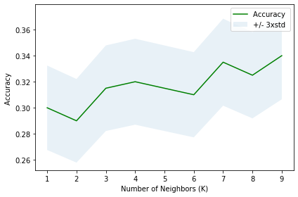

## K-Nearest Neighboor Classification
This project uses a dataset provided by [IBM Object Storage](https://s3-api.us-geo.objectstorage.softlayer.net/cf-courses-data/CognitiveClass/ML0101ENv3/labs/teleCust1000t.csv) with data about a telecommunications provider.

K-Nearest Neighboor (KNN) is a classification algorithm that make predictions based on the 'K' nearest points to the desired one. An example with only two independent features (variables) and one target feature (color), a prediction would be as depicted:

Since the dataset is composed of 11 independent features and one target feature, a visual representation of it was not produced.

The process of determining the best K value for the model yielded:

`The best accuracy was of 0.34 having k = 9`
