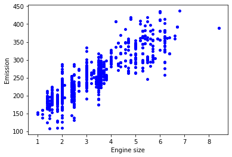
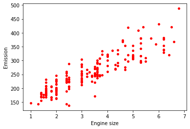

## Multiple Linear Regression
This project uses the same dataset as the Linear Regression project ( [IBM Object Storage](https://s3-api.us-geo.objectstorage.softlayer.net/cf-courses-data/CognitiveClass/ML0101ENv3/labs/FuelConsumptionCo2.csv) )
and creates a regression model to predict CO2 emissions.

This time two models are created switching some of the availiable covarites to observe the difference in the evaluation metrics.

A plot of the different training and testing data is also generated for better understanding of the process.

Although the results may vary, it was observed empirically that residual sum of squares of the first case was slightly lower than the second case

 #### Model w/ FUELCONSUMPTION_COMB
>
>Residual sum of squares: 527.49
>
>Variance score: 0.88
>
 #### Model w/ FUELCONSUMPTION_HWY and FUELCONSUMPTION_CITY
>
>Residual sum of squares: 529.34
>
>Variance score: 0.88
