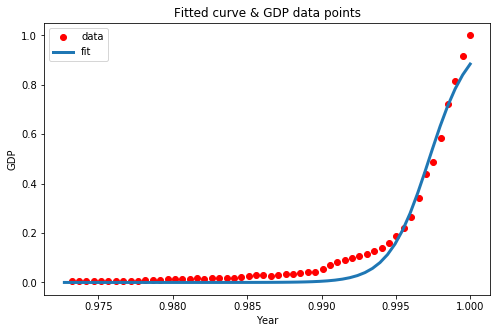

## Non-Linear Regression
This project uses a dataset provided by [IBM Object Storage](https://s3-api.us-geo.objectstorage.softlayer.net/cf-courses-data/CognitiveClass/ML0101ENv3/labs/china_gdp.csv) which has 
the datapoints corresponding to China's GDP from 1960 to 2014 given in two columns, the first, a year between 1960 and 2014, the second, China's GDP in US dollars for that year.

Before the application of the method, though, different non-linear functions are exemplified - such as quadratic, logarithmic and sigmoidal - that must be chosen to 
match different patterns/shapes of data.

  

Also an explanation of the chosen function is given and it's coeficients are explained.

`Mean absolute error: 0.03 | Residual sum of squares (MSE): 0.0018 | R2-score: 0.96`
