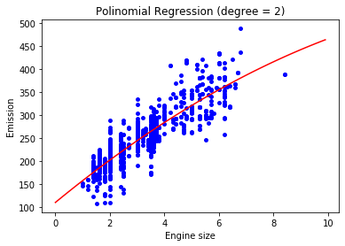
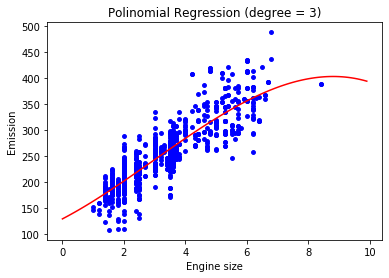

## Polynomial Regression
This project uses the same dataset as the Linear Regression project ( [IBM Object Storage](https://s3-api.us-geo.objectstorage.softlayer.net/cf-courses-data/CognitiveClass/ML0101ENv3/labs/FuelConsumptionCo2.csv) )
and creates a regression model to predict CO2 emissions. It does the process of regression by fitting only one ENGINESIZE while creating additional features: 1, x and x².

Although polynomial regression fits nonlinear relationships between the variables, it is still considered a linear regression
since it is linear in the regression coeficients - It replaces x for x1, x² for x2 and so on.

PR - Degree 2 | PR - Degree 3
------------ | -------------
Mean absolute error: 23.24 | Mean absolute error: 23.10
Residual sum of squares (MSE): 850.71 | Residual sum of squares (MSE): 844.13
R2-score: 0.72 | R2-score: 0.72
