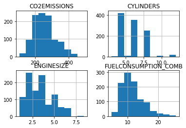
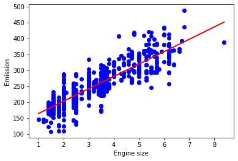

## Linear Regression
In this project,  using a dataset from IBM Object Storage ( located [HERE](https://s3-api.us-geo.objectstorage.softlayer.net/cf-courses-data/CognitiveClass/ML0101ENv3/labs/FuelConsumptionCo2.csv) )
a regression model was created to predict CO2 emissions.

The dataset contains model-specific fuel consumption ratings and estimated carbon dioxide emissions for new light-duty vehicles for retail sale in Canada.
[Dataset source](https://open.canada.ca/data/en/dataset/98f1a129-f628-4ce4-b24d-6f16bf24dd64)

From the dataset, the following columns were selected as possible covariates to the model: ENGINESIZE,CYLINDERS,FUELCONSUMPTION_COMB

Plots of the selected variables are made to help in the visualization of the trends, and the linear regression is displayed in the chosen one.

 
